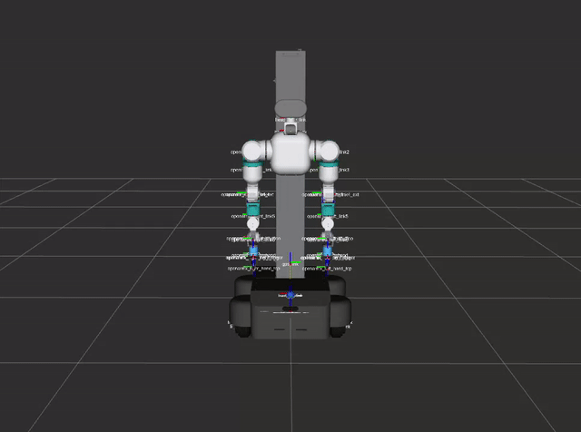

# openarmx_integrated_bringup

English | [中文](./README-CN.md)

---



Launch files and configurations for bringing up the complete OpenFlex integrated robot system.

## Overview

This package provides the primary launch file and controller configurations for the OpenArmX integrated robot, which combines a 4-wheel 4-steering (4W4S) swerve chassis, a linear lift module, dual 7-DOF + gripper arms, and a 2-DOF head into a single ros2_control system.

## System Architecture

```
base_link (chassis)
  -> lift_base_link -> lift_carriage_link
       -> left arm (8 joints)
       -> right arm (8 joints)
       -> head (2 joints: pitch + yaw)
```

## Controllers

| Controller | Type | Joints |
|-----------|------|--------|
| `joint_state_broadcaster` | JointStateBroadcaster | All joints |
| `swerve_drive_controller` | SwerveDriveController | 4 steering + 4 wheel joints |
| `left_forward_position_controller` | JointGroupPositionController | Left arm 8 joints |
| `right_forward_position_controller` | JointGroupPositionController | Right arm 8 joints |
| `head_forward_position_controller` | ForwardCommandController | Head yaw + pitch |
| `velocity_controller` | ParamForwardingVelocityController | lift_joint (velocity) |
| `lift_position_controller` | ParamForwardingPositionController | lift_joint (position) |
| `lift_manual_position_controller` | LiftSlideManualPositionController | lift_joint (manual) |
| `lift_state_controller` | LiftSlideStateController | lift_joint (state) |
| `left/right_forward_effort_controller` | ForwardCommandController | Arm effort (gravity comp) |

## Launch Files

### `integrated_robot_bringup.launch.py`

Starts the complete system:
- `robot_state_publisher` with integrated URDF (xacro)
- `ros2_control_node` with all hardware interfaces
- Controller spawners with staggered timing
- Optional RViz visualization
- Optional gravity compensation
- Optional auto-homing for the lift

### `integrated_vr_teleop.launch.py`

Starts the VR teleoperation stack (Pico pose bridge + arm teleop + chassis/lift/head control).

### `integrated_robot_o6_bringup.launch.py`

Starts the wheeled integrated robot with two LinkerHand O6 hands. The default uses a shared CAN bus: the right arm/right hand use `can0`, and the left arm/left hand use `can1`. The shared-bus configuration remains unchanged unless the hardware mode is explicitly overridden.

```bash
# Default: shared bus (right hand 0x27, left hand 0x28)
ros2 launch openarmx_integrated_bringup integrated_robot_o6_bringup.launch.py

# Simulation
ros2 launch openarmx_integrated_bringup integrated_robot_o6_bringup.launch.py \
  use_fake_hardware:=true \
  use_rviz:=true

# Independent CAN: right hand on can6, left hand on can7
ros2 launch openarmx_integrated_bringup integrated_robot_o6_bringup.launch.py \
  o6_hardware_mode:=independent \
  right_o6_can_interface:=can6 \
  left_o6_can_interface:=can7
```

Independent mode starts two standalone `hands_hardware/o6_driver_node` processes and connects their state through the O6 joint-state mapper and joint-state merger. It does not load the shared-bus O6 ros2_control plugin. Before launching, make sure `can6` and `can7` exist and are configured for classic CAN at 1 Mbps.

## Usage

```bash
# Build

---
cd ~/openflex_all/openflex_ws
colcon build --packages-select openarmx_integrated_bringup

# Real hardware

---
ros2 launch openarmx_integrated_bringup integrated_robot_bringup.launch.py

# Simulated hardware

---
ros2 launch openarmx_integrated_bringup integrated_robot_bringup.launch.py use_fake_hardware:=true

# Custom CAN assignment

---
ros2 launch openarmx_integrated_bringup integrated_robot_bringup.launch.py \
  chassis_steering_can:=can5 chassis_driving_can:=can4 \
  left_arm_can:=can1 right_arm_can:=can0 \
  lift_can:=can3 head_can:=can2

# With auto-homing

---
ros2 launch openarmx_integrated_bringup integrated_robot_bringup.launch.py auto_homing:=true
```

## Key Parameters

| Parameter | Default | Description |
|-----------|---------|-------------|
| `use_fake_hardware` | `false` | Simulated hardware mode |
| `use_rviz` | `true` | Launch RViz |
| `control_mode` | `mit` | Motor control mode (mit/csp) |
| `enable_head` | `true` | Enable head hardware and controller |
| `enable_forward_effort` | `true` | Enable gravity compensation |
| `auto_homing` | `false` | Auto-home lift on startup |

## Published Topics (via controllers)

| Topic | Type | Description |
|-------|------|-------------|
| `/joint_states` | `sensor_msgs/JointState` | All joint states at 100 Hz |
| `/cmd_vel` | `geometry_msgs/Twist` | Chassis velocity input |
| `/tf` | TF2 | `odom -> base_link` from swerve controller |

## Dependencies

- `openarmx_integrated_description`
- `swerve_bringup` / `swerve_controller` / `swerve_hardware`
- `openarmx_hardware`
- `lift_slide_driver` / `lift_slide_bringup`
- `openarmx_gravity_comp`
- `controller_manager`, `forward_command_controller`, `joint_state_broadcaster`

## License

This work is licensed under the Creative Commons Attribution-NonCommercial-ShareAlike 4.0 International License (CC BY-NC-SA 4.0).

Copyright (c) 2026 Chengdu Changshu Robot Co., Ltd. (成都长数机器人有限公司)

For more details, see the [LICENSE](LICENSE) file or visit: http://creativecommons.org/licenses/by-nc-sa/4.0/

## Acknowledgments

This package is part of the OpenArmX robotic platform ecosystem, developed for research and industrial applications in collaborative robotics.

---

## 📞 Contact Us

### Chengdu Changshu Robot Co., Ltd.

| Contact           | Information                                                                                                  |
| ----------------- | ------------------------------------------------------------------------------------------------------------ |
| 📧 Email          | [openarmrobot@gmail.com](mailto:openarmrobot@gmail.com)                                                      |
| 📱 Phone / WeChat | +86-17746530375                                                                                              |
| 🌐 Website        | [https://openarmx.com/](https://openarmx.com/)                                                               |
| 🌐 Documentation  | [http://docs.openarmx.com/](http://docs.openarmx.com/)                                                               |
| 📍 Address        | Huacheng Machinery Plant, No.11 Xinye 8th Street, West Area, Tianjin Economic-Technological Development Area |
| 👤 Contact Person | Mr. Wang                                                                                                     |
